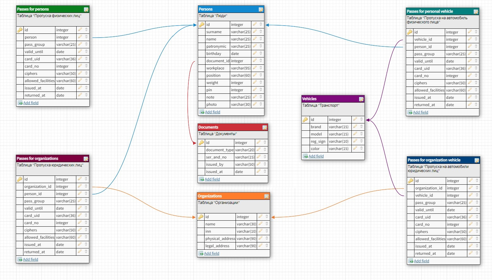
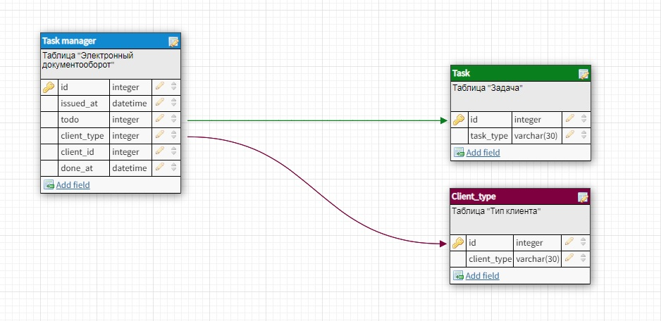
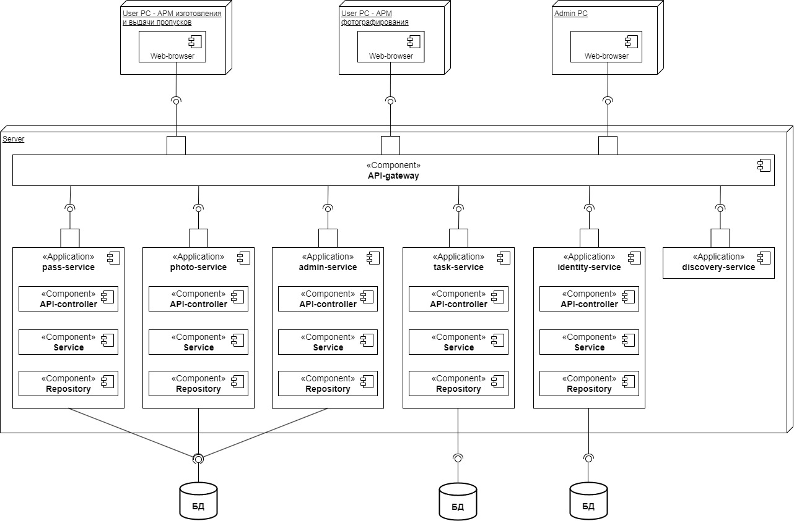

# `Веб-приложение Бюро пропусков`

## `Задача:`  
Необходимо спроектировать веб-приложение бюро пропусков. В приложении моделируются процессы работы бюро пропусков, в том числе создание/просмотр/редактирование учетной карточки субъекта (физ.лица, юр.лица, транспорт), ввод/редактирование данных о субъекте, учёт выдачи и возврата пропусков. В приложении должно быть три основных роли пользователя, отвечающих за ведение учётных карточек, за фотографирование субъектов, а также за администрирование системы. При этом каждой роли пользователя должен соответствовать свой набор прав, а также должен быть реализован механизм авторизации пользователей.  

## `Описание решения:`  

1. Доменная модель включает в себя следующие сущности и их атрибуты:
  * Физическое лицо (фамилия, имя, отчество, дата рождения, документ, место работы, должность, вес, пин-код, примечание, ссылка на фото) 
  * Документ (тип документа, серия и номер, кем выдан, дата выдачи)
  * Организация (название организации, ИНН, физический адрес, юридический адрес)  
  * Транспорт (марка, модель, госномер, цвет)  
  * Пропуск физ.лица (физ.лицо, вид пропуска, срок действия, id-карты, номер-карты, шифры, разрешенные объекты, дата выдачи, дата возврата)  
  * Пропуск юр.лица (юр.лицо, работник, вид пропуска, срок действия, id-карты, номер-карты, шифры, разрешенные объекты, дата выдачи, дата возврата)  
  * Пропуск на автомобиль физ.лица (физ.лицо, транспорт, вид пропуска, срок действия, id-карты, номер-карты, шифры, разрешенные объекты, дата выдачи, дата возврата)  
  * Пропуск на автомобиль юр.лица (организация, транспорт, вид пропуска, срок действия, id-карты, номер-карты, шифры, разрешенные объекты, дата выдачи, дата возврата)  
  * Задача (тип задачи - фотографирование, изготовление, выдача)  
  * Реестр задач (дата создания задачи, тип задачи, тип пропуска, ссылка на id клиента, дата выполнения задачи)  

2. ERD-модель домена представлена на диаграмме ниже:  

  

3. UML-диаграмма компонентов веб-приложения представлена ниже:

  

**`photo-service`** - сервис, предназначенный для получения фотографий и занесения их в базу данных. В дальнейшем данный сервис будет использоваться на АРМ фотографирования;  

**`admin-service`** – сервис, предназначенный для администрирования системы, создания новых пользователей и предоставления им прав доступа, администрирования баз данных и решения других задач. В дальнейшем данный сервис будет использоваться на АРМ администрирования;  

**`task-service`** – сервис, предназначенный для реализации электронного документооборота и организации работы пользователей разных АРМ бюро пропусков. Например, АРМ изготовления пропусков создал новую карточку физического лица, в результате чего в системе электронного документооборота на АРМ фотографирования появилась задача сделать фотографию для данного физического лица и сохранить её в систему. После этого в системе электронного документооборота на АРМ изготовления и выдачи пропусков появляется задача печати и выдачи пропуска физического лица;  

**`identity-service`** – сервис, предназначенный для реализации механизма авторизации пользователей в системе, создания токена и получения доступа к сервисам и функционалу системы в соответствии с предоставленными пользователю правами;  

**`discovery-service`** – сервис, реализующий механизм Eureka Server, предназначенный для обнаружения сервисов и их самостоятельной регистрации в нём. При этом сервисы или микросервисы могут обращаться к Eureka Server для поиска других сервисов или микросервисов;  

**`API-gateway`** – компонент, который является промежуточным звеном между пользовательским интерфейсом и сервисами и предназначен для перенаправления запросов от клиентов к службам, чтобы клиент не имели возможность направлять запросы напрямую к сервисам. Это помогает решать задачи обеспечения безопасности, такие как аутентификация пользователей, ограничение частоты запросов и т.д.  

